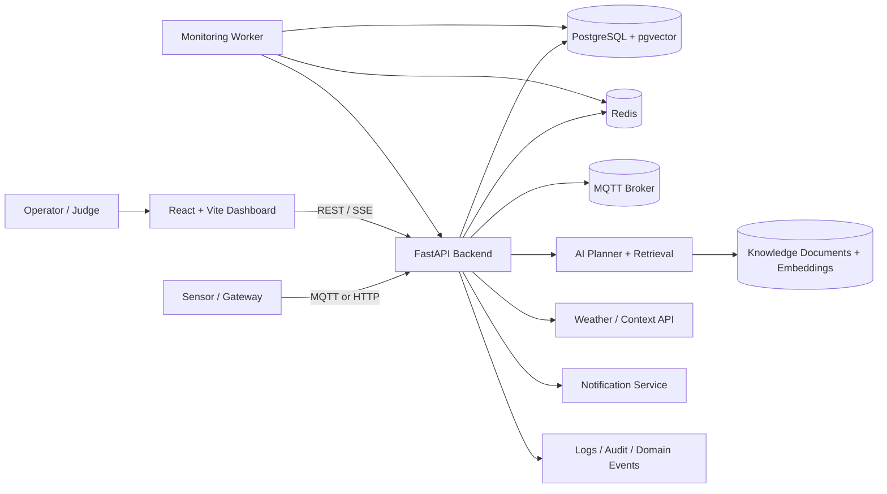
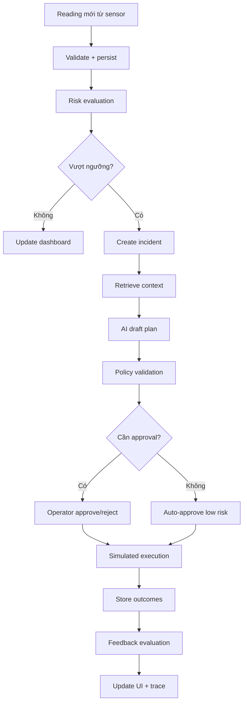
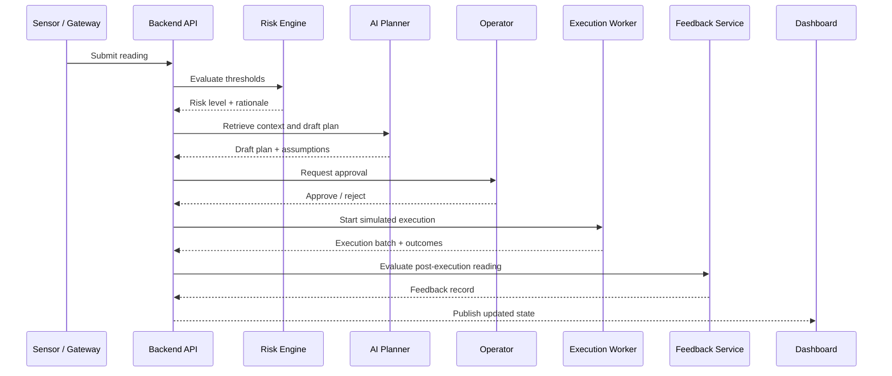
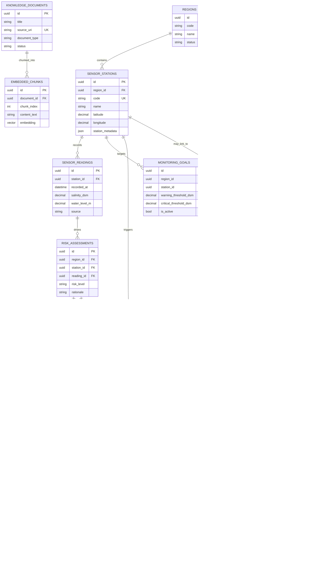
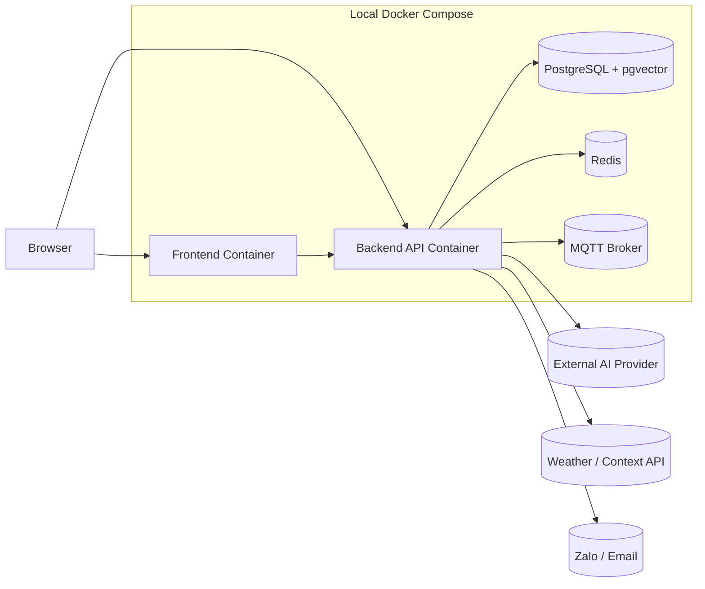

# Mekong-SALT - Technical Report Hackathon

## 1. Tổng quan dự án

**Mekong-SALT** là một hệ thống hỗ trợ giám sát xâm nhập mặn và điều phối phản ứng vận hành cho hạ tầng thủy lợi. Sản phẩm kết hợp ingest dữ liệu cảm biến theo thời gian thực, đánh giá rủi ro theo ngưỡng, gợi ý kế hoạch xử lý bằng AI, duyệt bởi con người, mô phỏng thực thi, và hiển thị toàn bộ trạng thái trên dashboard bản đồ.

Mục tiêu của dự án không phải là xây dựng một nền tảng enterprise hoàn chỉnh ngay từ đầu, mà là một **MVP hackathon có thể demo end-to-end**: dữ liệu vào được, hệ thống ra quyết định được, có trace, có approval, có execution mô phỏng, và có giao diện trình bày rõ ràng cho ban giám khảo.

### Thông tin dự án

| Hạng mục | Nội dung |
|---|---|
| Tên dự án | Mekong-SALT |
| Bài toán | Giám sát xâm nhập mặn và hỗ trợ quyết định vận hành cống / trạm quan trắc |
| Người dùng mục tiêu | Operator thủy lợi, cán bộ giám sát, mentor / judge hackathon |
| Giải pháp cốt lõi | Ingest -> Risk -> Plan -> Approval -> Simulated Execution -> Feedback |
| Tính năng chính | Sensor ingest, risk scoring, AI planning, approval workflow, dashboard, map, traceability |
| Công nghệ dự kiến | FastAPI, PostgreSQL, Redis, MQTT, React + Vite + TypeScript, Leaflet, Docker Compose |
| Thành phần AI | AI planner + retrieval context + policy guard |
| Giới hạn hackathon | 3-5 ngày, 3-4 người, ngân sách thấp, ưu tiên local demo |
| Phạm vi MVP | Một vùng demo, một luồng vận hành chính, dữ liệu seed, execution mô phỏng |

## 2. Problem Statement

Xâm nhập mặn là bài toán vận hành cần phản ứng nhanh nhưng lại thường bị phân mảnh ở nhiều lớp: cảm biến gửi dữ liệu rời rạc, operator phải đọc ngưỡng thủ công, quyết định đóng/mở cống chưa có trace rõ ràng, và việc hậu kiểm sau vận hành khó tổng hợp.

Các vấn đề chính:

- Dữ liệu cảm biến đến từ nhiều kênh nhưng không có một luồng xử lý thống nhất.
- Operator cần không chỉ số liệu thô mà còn cần một kết luận vận hành rõ ràng.
- Quy trình approval vẫn cần con người duyệt, nhưng phải bám trên dữ liệu và lý do cụ thể.
- Sau khi thực thi, cần lưu lại bằng chứng, lịch sử và kết quả.
- Với hackathon, hệ thống phải **dễ demo, dễ reset, dễ trình bày** và không phụ thuộc quá nhiều vào dịch vụ bên ngoài.

Mekong-SALT giải quyết bằng một workflow thống nhất: **sensor -> risk -> plan -> approval -> execution -> feedback**.

## 3. Mục tiêu hệ thống

### Mục tiêu kỹ thuật

- Ingest dữ liệu từ HTTP hoặc MQTT theo cùng một schema.
- Chuẩn hóa salinity về đơn vị canonical để đánh giá ngưỡng nhất quán.
- Sinh kế hoạch hành động có giải thích và ràng buộc policy.
- Hỗ trợ duyệt thủ công trước khi thực thi.
- Mô phỏng execution để demo an toàn.
- Lưu đầy đủ trace, audit log, notification, feedback.

### Success criteria

- Chạy được local bằng một lệnh Docker Compose.
- Seed xong là có ngay station, gate, reading, incident, plan, timeline.
- Một reading mới có thể kích hoạt risk và plan mới.
- Approval thay đổi state của plan một cách minh bạch.
- Execution batch và feedback nhìn thấy được trên UI / API.
- Rerun demo từ đầu mà không cần dọn thủ công database.

## 4. Phạm vi MVP và ngoài phạm vi

### In scope

- Sensor ingest qua HTTP và MQTT.
- Risk evaluation dựa trên ngưỡng salinity.
- Tạo incident và action plan.
- AI-assisted planning với retrieval.
- Human approval workflow.
- Execution mô phỏng và feedback hậu thực thi.
- Dashboard, timeline, map, trace, logs.
- Seed script để tái tạo demo.

### Out of scope

- Điều khiển cống thật ngoài hiện trường.
- SSO / IAM enterprise đầy đủ.
- Mobile app.
- Multi-region / multi-tenant production scale.
- Geospatial analytics nâng cao kiểu remote-sensing production.
- Tích hợp sâu với SCADA / ERP thực tế.

Lý do loại bỏ các phần này là để đảm bảo **khả thi trong hackathon**, không làm loãng mục tiêu demo chính.

## 5. User roles và use cases chính

| Role | Trách nhiệm | Use cases chính |
|---|---|---|
| Operator | Giám sát vận hành, đưa quyết định | Xem readings, duyệt plan, theo dõi execution |
| Supervisor / Judge | Đánh giá chất lượng giải pháp | Kiểm tra luồng end-to-end, tính hợp lý kỹ thuật |
| Admin / Demo maintainer | Quản trị dữ liệu demo | Seed lại dữ liệu, xem log, kiểm tra trạng thái |
| Device / Gateway | Gửi telemetry | Publish sensor reading qua MQTT hoặc HTTP |
| AI Planner | Đề xuất kế hoạch | Lấy context, tạo plan, giải thích assumptions |

### Use cases cốt lõi

1. Đọc dữ liệu cảm biến mới.
2. Đánh giá mức độ mặn và tạo incident nếu vượt ngưỡng.
3. Sinh kế hoạch xử lý.
4. Duyệt hoặc từ chối kế hoạch.
5. Mô phỏng thi hành và ghi feedback.
6. Quan sát toàn bộ diễn biến trên dashboard.

## 6. Functional requirements

| ID | Yêu cầu | Ưu tiên |
|---|---|---|
| FR-01 | Hệ thống phải ingest được reading gồm station, thời gian, salinity, water level, source. | Cao |
| FR-02 | Hệ thống phải tránh ghi trùng reading bằng idempotency / unique constraint. | Cao |
| FR-03 | Hệ thống phải tính risk level từ reading mới nhất. | Cao |
| FR-04 | Hệ thống phải tạo incident khi risk vượt ngưỡng. | Cao |
| FR-05 | Hệ thống phải sinh plan có objective, assumptions, steps. | Cao |
| FR-06 | Hệ thống phải yêu cầu approval cho plan có ảnh hưởng vận hành. | Cao |
| FR-07 | Hệ thống phải mô phỏng execution và lưu outcomes. | Cao |
| FR-08 | Hệ thống phải lưu feedback hậu thực thi. | Cao |
| FR-09 | Hệ thống phải hiển thị dashboard summary, timeline, map, trace. | Cao |
| FR-10 | Hệ thống phải hỗ trợ seed / reset dữ liệu demo. | Cao |
| FR-11 | Hệ thống phải có notification / audit log để phục vụ hậu kiểm. | Trung bình |

## 7. Non-functional requirements

| Nhóm | Yêu cầu |
|---|---|
| Performance | Dashboard phải phản hồi nhanh với dữ liệu mới, mục tiêu demo vài giây sau ingest |
| Reliability | Message trùng không tạo record trùng; worker phải tự retry khi lỗi tạm thời |
| Observability | Có log, audit log, domain event, API đọc trạng thái |
| Maintainability | Backend modular monolith, rõ boundary giữa service/repository/api |
| Portability | Chạy được local với Docker Compose |
| Security | Secrets không hardcode; demo auth có thể tắt nhưng phải nêu rõ |
| Demo resilience | Có seed/reset và fallback khi AI hoặc external service lỗi |

## 8. Kiến trúc hệ thống

Kiến trúc được thiết kế theo hướng **modular monolith + worker**. Đây là lựa chọn phù hợp nhất cho hackathon vì:

- triển khai nhanh,
- dễ debug,
- giảm chi phí orchestration,
- vẫn giữ được boundary rõ để future scale.

### Thành phần chính

| Thành phần | Công nghệ | Vai trò |
|---|---|---|
| Frontend | React + Vite + TypeScript + Leaflet | Dashboard, map, approval, timeline |
| Backend API | FastAPI | REST API, orchestration, validation |
| Worker | Python background worker | Active monitoring, MQTT ingest, execution flow |
| Database | PostgreSQL + pgvector | Dữ liệu nghiệp vụ, vector retrieval |
| Cache / lock | Redis | Locking, caching, retry coordination |
| Broker | MQTT | Kênh ingest từ device / gateway |
| AI service | Provider abstraction | Draft kế hoạch + retrieval |
| External services | Weather, Zalo, Earth Engine (optional) | Context / notification / spatial enrichment |
| Observability | Audit logs, domain events, app logs | Traceability và debugging |

### Sơ đồ kiến trúc hệ thống

### Giải thích thiết kế

- Frontend chỉ làm presentation layer, không chứa logic nghiệp vụ nặng.
- Backend giữ state workflow để hệ thống có thể tiếp tục chạy dù reload UI.
- Worker xử lý các tác vụ nền như active monitoring và MQTT ingest.
- AI không được phép tự ý điều khiển; nó chỉ đưa ra plan gợi ý và phải qua policy guard.
- PostgreSQL đủ cho MVP vì vừa lưu dữ liệu quan hệ vừa có pgvector cho retrieval.

## 9. Workflow end-to-end

Luồng demo trung tâm:

1. Device/gateway gửi sensor reading.
2. Backend validate và lưu reading.
3. Risk engine đánh giá mức độ mặn.
4. Nếu vượt ngưỡng, tạo incident.
5. AI retrieval lấy context từ SOP / guideline / casebook.
6. AI tạo plan nháp.
7. Policy guard kiểm tra plan.
8. Operator duyệt hoặc từ chối.
9. Execution worker mô phỏng hành động.
10. Feedback evaluator ghi nhận kết quả sau execution.
11. Dashboard cập nhật timeline và trace.

### Workflow chính

### Quyết định quan trọng: cách đánh giá risk

Hệ thống không đánh giá risk theo cảm tính. Risk được tính bằng **rule deterministic** để đảm bảo kết quả ổn định, dễ kiểm thử, và dễ giải thích khi demo.

#### Nguyên tắc đánh giá

- Đơn vị canonical để lưu và so sánh là `dS/m`.
- Reading mới nhất là nguồn chính để quyết định risk.
- Trend chỉ được phép làm xấu thêm hoặc giữ nguyên mức risk, không tự ý kéo giảm.
- Context ngoài như thời tiết, tide, hoặc Earth Engine chỉ là yếu tố bổ trợ.
- Nếu AI hoặc nguồn context lỗi, hệ thống vẫn ra quyết định từ rule cốt lõi.

#### Risk scoring matrix

| Band | Điều kiện salinity | Ý nghĩa vận hành | Hành động hệ thống |
|---|---|---|---|
| Safe | `< 1.00 dS/m` | Mức an toàn | Chỉ cập nhật dashboard |
| Warning | `>= 1.00` và `< 2.50 dS/m` | Bắt đầu cần theo dõi chặt | Ghi risk warning, chuẩn bị context |
| Danger | `>= 2.50` và `< 4.00 dS/m` | Nguy cơ cao | Tạo incident và draft plan |
| Critical | `>= 4.00 dS/m` | Nguy cấp | Ưu tiên cao, cần approval nhanh |

#### Yếu tố điều chỉnh risk

| Yếu tố | Tác động |
|---|---|
| Trend tăng nhanh | Có thể đẩy risk lên 1 band nếu vượt ngưỡng hỗ trợ |
| Trend giảm | Ghi trong rationale, nhưng không tự động kéo risk xuống dưới band salinity |
| Wind / tide mạnh | Tăng mức cảnh giác khi reading đã ở band warning trở lên |
| Confidence thấp | Tăng mức cần review của operator |
| Dữ liệu thiếu / lỗi | Hệ thống fallback về trạng thái safe-observe hoặc yêu cầu kiểm tra |

#### Logic diễn giải nội bộ

`final_risk = max(risk_from_salinity, risk_from_trend_modifier, risk_from_context_modifier)`

Trong đó:

- `risk_from_salinity` là band chính.
- `risk_from_trend_modifier` chỉ có tác dụng làm xấu thêm.
- `risk_from_context_modifier` chỉ có tác dụng khuếch đại khi context đủ tin cậy.

#### Vì sao chọn cách này

- Dễ trình bày cho judge vì rule rõ ràng.
- Dễ kiểm thử bằng seed data và demo scenarios.
- Giảm hallucination và giảm sai lệch giữa frontend, API, và worker.
- Phù hợp với một hệ thống vận hành thực tế, nơi độ ổn định quan trọng hơn “AI đoán mò”.

### Sequence diagram cho luồng quan trọng

## 10. Thiết kế cơ sở dữ liệu

Schema được thiết kế theo nguyên tắc: **mỗi bước nghiệp vụ quan trọng đều có record riêng** để có thể trace từ data -> decision -> action -> feedback.

### Entity chính

| Entity | PK | Vai trò |
|---|---|---|
| regions | id | Phạm vi vận hành / địa bàn |
| sensor_stations | id | Trạm cảm biến |
| control_gates | id | Cống / gate |
| sensor_readings | id | Dữ liệu đo đạc |
| monitoring_goals | id | Cấu hình ngưỡng |
| risk_assessments | id | Kết quả đánh giá rủi ro |
| incidents | id | Sự kiện vận hành |
| action_plans | id | Kế hoạch xử lý |
| approvals | id | Quyết định duyệt / từ chối |
| execution_batches | id | Phiên mô phỏng thực thi |
| action_executions | id | Từng bước action |
| feedback_lifecycle_records | id | Kết quả hậu kiểm |
| notifications | id | Bản ghi thông báo |
| agent_runs | id | Trace cho planner / worker |
| domain_events | sequence | Event stream kỹ thuật |
| knowledge_documents | id | Tài liệu tri thức |
| embedded_chunks | id | Chunk vector để retrieval |

### Thuộc tính quan trọng

- `sensor_stations`: `code`, `name`, `latitude`, `longitude`, `station_metadata`, `risk_level`
- `control_gates`: `code`, `name`, `gate_type`, `status`, `latitude`, `longitude`, `gate_metadata`
- `sensor_readings`: `station_id`, `recorded_at`, `salinity_dsm`, `water_level_m`, `source`, `context_payload`
- `monitoring_goals`: `region_id`, `station_id`, `warning_threshold_dsm`, `critical_threshold_dsm`, `auto_plan_enabled`, `is_active`
- `risk_assessments`: `reading_id`, `risk_level`, `trend_direction`, `rationale`
- `action_plans`: `incident_id`, `objective`, `summary`, `plan_steps`, `validation_result`
- `execution_batches`: `plan_id`, `status`, `simulated`, `started_at`, `completed_at`
- `feedback_lifecycle_records`: `batch_id`, `plan_id`, `outcome_class`, `summary`, `replan_recommended`
- `knowledge_documents`: `title`, `source_uri`, `document_type`, `status`, `content_text`, `metadata_payload`
- `embedded_chunks`: `document_id`, `chunk_index`, `content_text`, `embedding`

### Quan hệ chính

| Quan hệ | Ý nghĩa |
|---|---|
| regions 1-N sensor_stations | Một vùng có nhiều trạm |
| regions 1-N control_gates | Một vùng có nhiều cống |
| sensor_stations 1-N sensor_readings | Mỗi trạm sinh nhiều reading |
| sensor_readings 1-1 risk_assessments | Reading dẫn đến một kết quả đánh giá |
| risk_assessments 1-N incidents | Một risk có thể tạo ra incident |
| incidents 1-N action_plans | Một incident có thể sinh plan |
| action_plans 1-N approvals | Plan có history duyệt |
| action_plans 1-N execution_batches | Plan có thể được thực thi mô phỏng |
| execution_batches 1-N action_executions | Một batch có nhiều action step |
| execution_batches 1-N feedback_lifecycle_records | Batch có feedback hậu kiểm |
| knowledge_documents 1-N embedded_chunks | Document được chunk hóa để retrieval |

### Đề xuất index

- `sensor_readings(station_id, recorded_at DESC, source)`
- `sensor_stations(code)` và `control_gates(code)`
- `monitoring_goals(region_id, is_active)`
- `risk_assessments(region_id, created_at DESC)`
- `action_plans(region_id, status, created_at DESC)`
- `execution_batches(plan_id, started_at DESC)`
- `feedback_lifecycle_records(batch_id, evaluated_at DESC)`
- `knowledge_documents(source_uri)`
- `embedded_chunks(document_id, chunk_index)`

### ERD database

### Giải thích schema ngắn gọn

- Tách riêng reading, risk, incident, plan, approval, execution, feedback để trace được toàn bộ vòng đời quyết định.
- Dùng JSON cho metadata linh hoạt của station/gate vì dữ liệu này có thể thay đổi theo từng đợt demo hoặc từng vùng.
- Dùng vector table cho RAG retrieval thay vì nhét tất cả vào logic runtime.
- Dùng UUID để an toàn khi sinh record phân tán và thuận tiện nếu sau này tách service.

## 11. Thiết kế API

API version hóa tại `/api/v1`. Ở MVP demo, auth có thể tắt để giảm friction; tuy nhiên phải ghi rõ đây là **demo mode**, không phải production security model.

| Method | Endpoint | Chức năng | Auth | Request / Response summary |
|---|---|---|---|---|
| GET | `/health` | Kiểm tra trạng thái hệ thống | No | Trả health / readiness metadata |
| POST | `/sensors/ingest` | Nhận sensor reading | Demo no-auth | Payload reading -> persisted record / dedup result |
| GET | `/readings/latest` | Lấy reading mới nhất | No | Danh sách reading theo station |
| GET | `/readings/history` | Lấy lịch sử reading | No | Trả dữ liệu theo station / thời gian |
| POST | `/goals` | Tạo monitoring goal | Demo only | Thresholds, interval, auto-plan |
| GET | `/goals` | Danh sách goals | Demo only | List monitoring goals |
| PATCH | `/goals/{goal_id}` | Cập nhật goal | Demo only | Update thresholds / active |
| GET | `/risk/latest` | Lấy risk hiện tại | No | Risk level, rationale, trend |
| POST | `/incidents` | Tạo incident | Demo only | Incident details |
| GET | `/incidents` | Liệt kê incident | No | Timeline incident |
| GET | `/plans` | Liệt kê plan | No | Plan summary list |
| GET | `/plans/{plan_id}` | Chi tiết plan | No | Steps, assumptions, validation |
| POST | `/approvals/plans/{plan_id}/decision` | Duyệt / từ chối plan | Demo only | decision + comment |
| GET | `/approvals/plans/{plan_id}/history` | Lịch sử approval | Demo only | Decision trail |
| GET | `/execution-batches` | Danh sách batch | No | Batch list |
| GET | `/execution-batches/{batch_id}` | Chi tiết batch | No | Steps, status, outcomes |
| GET | `/action-outcomes` | Danh sách outcome | No | Timeline of results |
| POST | `/feedback/execution-batches/{batch_id}/evaluate` | Đánh giá hậu thực thi | Demo only | before/after -> feedback record |
| GET | `/feedback/execution-batches/{batch_id}/latest` | Feedback mới nhất | No | latest lifecycle record |
| GET | `/dashboard/summary` | Summary card | No | Count, KPI, current states |
| GET | `/dashboard/timeline` | Timeline | No | Readings, incidents, plans, executions |
| GET | `/dashboard/stream` | SSE live stream | No | Push operational updates |
| GET | `/dashboard/earth-engine/latest` | Context địa lý / EO | No | Spatial summary nếu bật |
| GET | `/agent/runs` | Trace AI / worker | No | Planner / workflow traces |
| GET | `/audit/logs` | Audit log | Demo only | Ai làm gì, khi nào |
| GET | `/notifications` | Notification records | Demo only | Dashboard / Zalo / email log |
| GET | `/stations` | Danh mục trạm | No | Station catalog |
| GET | `/gates` | Danh mục cống | No | Gate catalog |

## 12. Thiết kế module AI / analytics

### Vai trò của AI

AI không quyết định thay con người. AI chỉ đóng vai trò:

- tổng hợp context từ tri thức vận hành,
- đề xuất plan nháp,
- tạo giải thích ngắn gọn,
- hỗ trợ judge nhìn thấy “trí tuệ hệ thống” nhưng vẫn kiểm soát được.

### Input / Output

| Thành phần | Input | Output |
|---|---|---|
| AI Planner | Reading mới nhất, risk summary, incident context, knowledge snippets | Draft plan, assumptions, recommended steps |
| Retrieval | Query từ reading / incident / objective | Relevant chunks, citations, SOP references |
| Policy Guard | Draft plan + constraints | Pass / reject + validation reasons |
| Feedback analytics | Before / after snapshot, execution outcome | Outcome class, replan recommendation |

### Luồng prompt / reasoning flow

1. Lấy dữ liệu đọc mới nhất và ngữ cảnh của vùng/trạm.
2. Retrieve các tài liệu liên quan: SOP, threshold, casebook, guideline.
3. Gửi prompt cho AI planner theo format có cấu trúc.
4. AI sinh plan nháp với assumptions rõ ràng.
5. Policy guard kiểm tra plan có vượt ngưỡng an toàn hay không.
6. Nếu AI lỗi hoặc trả lời không hợp lệ, dùng fallback deterministic plan template.

### Cách giảm hallucination

- Chỉ cho AI dùng context đã retrieve, không để “tưởng tượng” nguồn bên ngoài.
- Ép output theo schema có cấu trúc.
- Kết quả plan phải qua policy guard deterministic.
- Mỗi plan đều lưu assumptions và validation_result.
- Nếu retrieval trống, trả về plan fallback thay vì bịa nội dung.

### Lý do chọn model / kiến trúc AI

- Dùng abstraction provider thay vì hardcode một model để dễ đổi nhà cung cấp.
- Với hackathon, cần ưu tiên tốc độ trả lời, chi phí thấp, và dễ fallback.
- Kiến trúc này vẫn cho phép demo AI thật nhưng không làm hệ thống phụ thuộc tuyệt đối vào AI.

## 13. Kiến trúc triển khai

### Deployment architecture

### Kiến trúc deploy cho hackathon

- **Local-first** bằng Docker Compose để tránh dependency drift.
- Backend và frontend cùng chạy trong một topology đơn giản.
- PostgreSQL lưu data và embeddings, nên không cần thêm vector DB riêng cho MVP.
- MQTT broker local giúp mô phỏng device traffic thật.
- Nếu cần live demo gọn hơn, có thể chỉ dùng browser + local compose mà không cần cloud.

## 14. Security / privacy

### MVP security posture

- Auth có thể tắt trong demo để tránh mất thời gian trình bày.
- Tất cả secrets phải nằm trong env file hoặc secret manager, không hardcode.
- Payload phải được validate trước khi ghi DB.
- Sensor message trùng phải bị chặn bằng unique constraint / idempotency.
- Audit log phải ghi lại các hành động quan trọng: ingest, approval, execution, feedback.

### Privacy

- Hệ thống chủ yếu xử lý telemetry vận hành, không phải dữ liệu cá nhân nhạy cảm.
- Nếu log tên operator trong approval, chỉ giữ trong phạm vi audit cần thiết.
- Không nên đưa access token thật vào demo package.

### Hướng production hardening

- Bật JWT / SSO.
- RBAC cho operator / supervisor / admin.
- Secret manager cho API keys.
- Rate limiting cho endpoint nhạy cảm.
- Encryption at rest nếu phạm vi pháp lý yêu cầu.

## 15. Scalability và hướng mở rộng

### Mở rộng ngắn hạn

- Thêm ingest Pub/Sub song song MQTT.
- Thêm dashboard panel cho ingest metrics và DLQ.
- Thêm Earth Engine / spatial context cho vùng quan trắc.
- Thêm filter theo station / time range / severity.

### Mở rộng dài hạn

- Tách backend thành service khi team / traffic đủ lớn.
- Thêm forecasting salinity trend.
- Thêm real actuator integration cho gate control.
- Thêm multi-region support cho nhiều lưu vực.
- Thêm knowledge curation pipeline cho tài liệu nghiệp vụ.

### Vì sao kiến trúc hiện tại vẫn hợp lý

Kiến trúc modular monolith đủ nhanh cho hackathon nhưng vẫn có các boundary để sau này tách service mà không phải viết lại toàn bộ.

## 16. Quyết định thiết kế quan trọng

### 16.1 Cách đánh giá risk

Hệ thống dùng **đánh giá risk theo ngưỡng deterministic** thay vì phụ thuộc hoàn toàn vào ML model. Đây là quyết định quan trọng nhất của domain vì salinity là bài toán vận hành cần tính ổn định cao.

**Cách làm:**

- Canonical unit lưu trữ và so sánh là `dS/m`.
- Risk được phân band theo ngưỡng: `safe`, `warning`, `danger`, `critical`.
- Trend chỉ đóng vai trò khuếch đại hoặc làm xấu thêm mức risk, không được phá vỡ band chính.
- External context như thời tiết, tide, hoặc Earth Engine chỉ là **modifier**, không override reading mới nhất.

**Lý do chọn:**

- Dễ giải thích cho judge và operator.
- Tránh tình trạng model “đoán” sai mức độ nguy cấp.
- Giữ tính nhất quán giữa UI, API và seed data.

### 16.2 Quyết định về approval

Hệ thống dùng **human-in-the-loop approval** cho các plan có ảnh hưởng vận hành đáng kể.

**Cách làm:**

- Plan chỉ được tự động advance nếu nằm trong vùng rủi ro thấp và policy cho phép.
- Plan có risk cao phải chờ operator duyệt hoặc từ chối.
- Mọi quyết định approval đều được lưu history để truy vết.

**Lý do chọn:**

- Giảm rủi ro khi demo.
- Phù hợp với bài toán thực tế nơi con người vẫn phải chịu trách nhiệm cuối.
- Cho phép judge nhìn thấy ranh giới giữa AI suggestion và operational decision.

### 16.3 Quyết định về execution

Hệ thống **không điều khiển cống thật**, mà dùng **simulated execution**.

**Cách làm:**

- Plan được chuyển sang execution batch mô phỏng.
- Mỗi action step được lưu thành action execution record.
- Sau execution có feedback evaluation để xem plan có tạo cải thiện hay không.

**Lý do chọn:**

- An toàn cho hackathon.
- Không phụ thuộc vào phần cứng ngoài.
- Vẫn chứng minh được khả năng vận hành end-to-end.

### 16.4 Quyết định về AI

AI được dùng để **đề xuất và giải thích**, không phải để quyết định hoàn toàn.

**Cách làm:**

- Context được retrieve từ SOP, threshold guide, casebook và knowledge corpus.
- AI tạo draft plan theo schema có cấu trúc.
- Policy guard kiểm tra đầu ra trước khi hệ thống chấp nhận.
- Nếu AI lỗi hoặc đầu ra không hợp lệ, hệ thống dùng fallback deterministic template.

**Lý do chọn:**

- Giảm hallucination.
- Dễ demo trong điều kiện model ngoài không ổn định.
- Tạo cảm giác “AI thật” nhưng vẫn kiểm soát được chất lượng.

### 16.5 Quyết định về dữ liệu và truy vết

Hệ thống lưu dữ liệu theo từng bước nghiệp vụ thay vì chỉ lưu kết quả cuối.

**Cách làm:**

- Reading, risk, incident, plan, approval, execution, feedback được tách bảng.
- Domain events và audit logs giữ lịch sử thay đổi.
- Agent runs lưu trace cho quy trình AI / orchestration.

**Lý do chọn:**

- Dễ giải thích trong demo.
- Dễ debug khi sai.
- Dễ mở rộng sang phân tích sau này.

### 16.6 Quyết định về ingest và giao diện

**Ingest:** MQTT là đường chính cho demo, HTTP là fallback.

**UI:** Leaflet được dùng cho map vì đủ nhẹ, dễ tích hợp, và đủ tốt để hiển thị station/gate markers.

**Lý do chọn:**

- MQTT phản ánh bối cảnh IoT thật hơn.
- HTTP giúp cứu demo khi broker lỗi.
- Leaflet đủ nhanh để build một giao diện trực quan trong thời gian ngắn.

## 17. Technical trade-offs và assumptions

| Quyết định | Trade-off | Lý do chọn |
|---|---|---|
| Modular monolith thay vì microservices | Ít độc lập scale hơn | Nhanh triển khai, ít phức tạp |
| Execution mô phỏng thay vì điều khiển thật | Chưa phải production control | An toàn và phù hợp hackathon |
| Auth tắt ở demo | Security giảm trong local demo | Giảm friction, dễ trình bày |
| AI gợi ý + policy guard | Không “fully autonomous” | Giảm hallucination, tăng độ tin cậy |
| PostgreSQL + pgvector | DB phải xử lý thêm vector | Giảm số service cần vận hành |
| Leaflet bản đồ đơn giản | Ít GIS nâng cao | Dễ dùng, đủ đẹp cho pitch |

### Assumptions

- Ban giám khảo ưu tiên hệ thống chạy được hơn là độ phức tạp kiến trúc.
- Demo chạy trong local environment là đủ.
- External service có thể lỗi bất kỳ lúc nào, nên luôn cần fallback.
- Dữ liệu seed là đại diện đủ tốt cho một khu vực demo.

## 18. Kế hoạch triển khai trong hackathon

### Giai đoạn 1 - chốt scope và chạy được nền tảng

- Chốt scenario demo chính.
- Hoàn thiện seed script và dữ liệu mẫu.
- Đảm bảo Docker Compose chạy ổn định.

### Giai đoạn 2 - hoàn thiện end-to-end flow

- Kết nối ingest -> risk -> incident -> plan.
- Hoàn thiện approval workflow.
- Hoàn thiện execution mô phỏng và feedback.

### Giai đoạn 3 - làm đẹp demo và traceability

- Tối ưu dashboard summary, timeline, map.
- Làm rõ nhãn trạng thái, giải thích, metadata.
- Thêm audit / trace / notification views.

### Giai đoạn 4 - AI và trình bày

- Chốt prompt template và fallback.
- Kiểm tra output có schema ổn định.
- Luyện demo theo đúng kịch bản và dự phòng lỗi.

### Những gì có thể demo live

- Một reading mới xuất hiện trên hệ thống.
- Risk đổi sang warning / danger / critical.
- Incident và plan được tạo ra.
- Operator approve / reject.
- Execution batch và feedback được ghi nhận.

### Những gì mock / simulate

- Actuation thật của cống.
- Một số response của AI provider nếu service ngoài lỗi.
- Một phần spatial / weather context nếu không có network.

## 19. Rủi ro và hướng giảm thiểu

| Rủi ro | Ảnh hưởng | Giảm thiểu |
|---|---|---|
| MQTT broker lỗi | Luồng ingest live bị ngắt | Có HTTP fallback và healthcheck |
| AI không trả kết quả hợp lệ | Plan generation bị gián đoạn | Dùng fallback template và policy guard |
| Duplicate message | Ghi trùng dữ liệu | Unique constraint + idempotency key |
| Seed data lệch | Demo không đồng nhất | Seed có cơ chế reset region demo |
| Dashboard chậm | Ảnh hưởng trải nghiệm judge | Dùng query gọn, summary endpoint, pagination |
| Story demo dài và loãng | Giảm điểm trình bày | Chỉ giữ một luồng chính, không lan man |

## 20. Kết luận

Mekong-SALT là một đề tài hackathon mạnh vì nó có cả **độ thực tế nghiệp vụ** lẫn **độ chín kỹ thuật để demo**. Hệ thống không chỉ hiển thị dữ liệu, mà mô tả được một vòng đời vận hành đầy đủ: cảm biến gửi vào, hệ thống phân tích, AI đề xuất, con người duyệt, thực thi mô phỏng, và feedback quay lại để học tiếp.

Với kiến trúc modular monolith, PostgreSQL, Redis, MQTT, FastAPI, React + Leaflet, và một AI module có policy guard, dự án đủ gọn để làm trong thời gian hackathon nhưng vẫn đủ sâu để tạo ấn tượng với giám khảo. Đây là một thiết kế có thể trình bày như một sản phẩm kỹ thuật thực thụ, không phải một demo UI rời rạc.